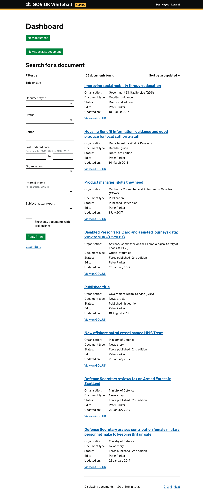
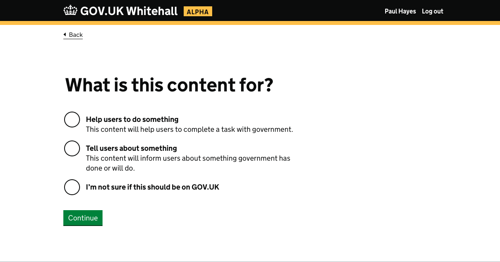
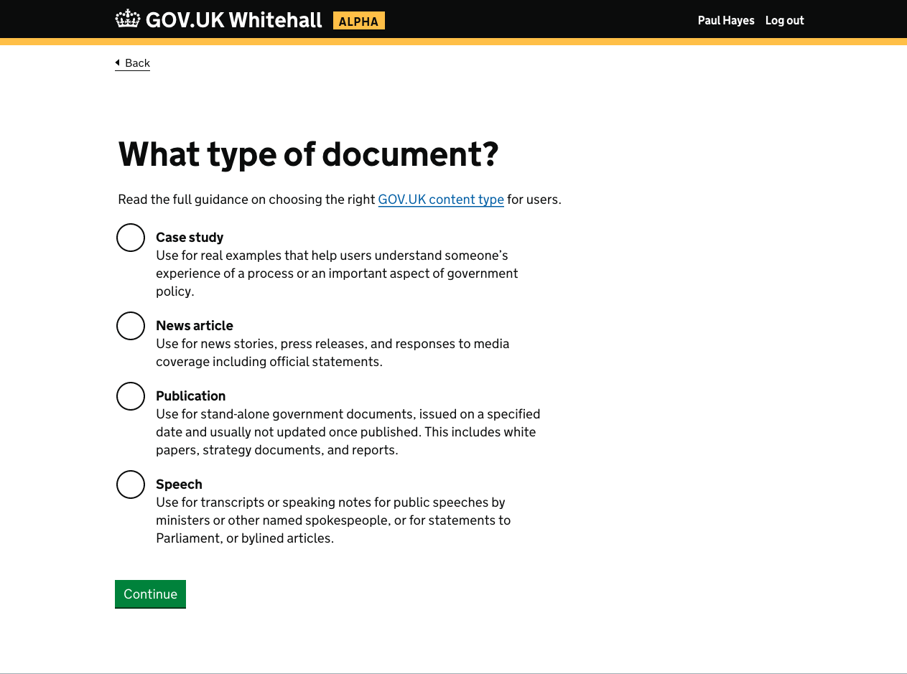
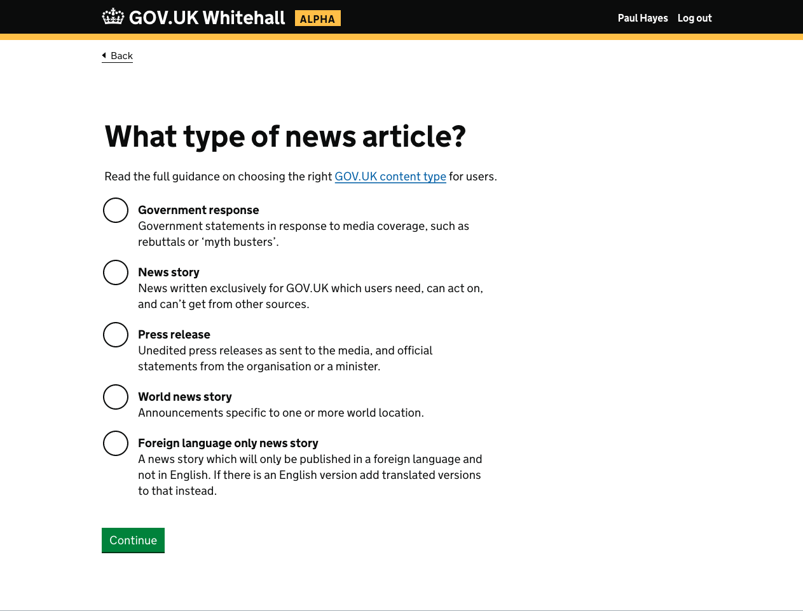
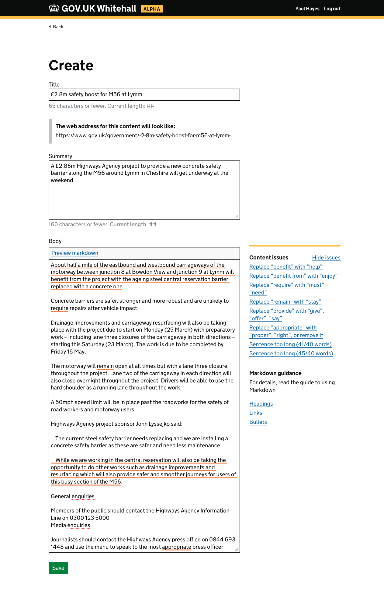
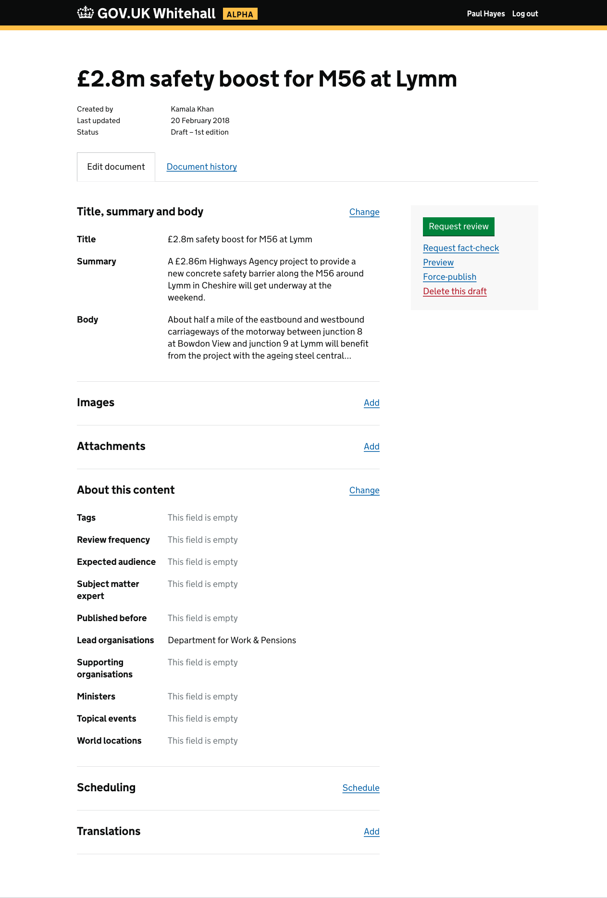
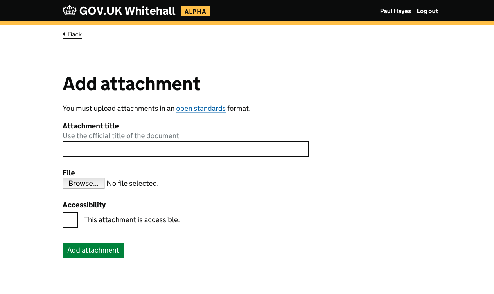
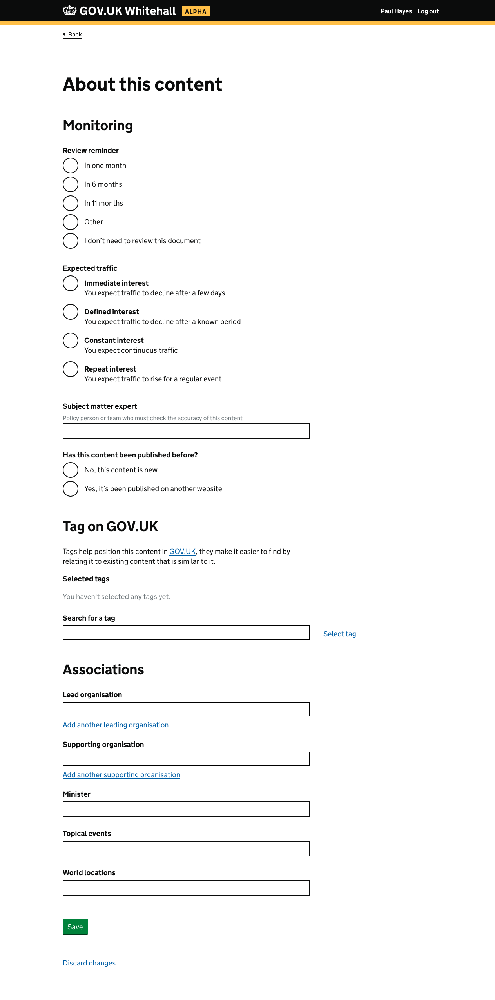
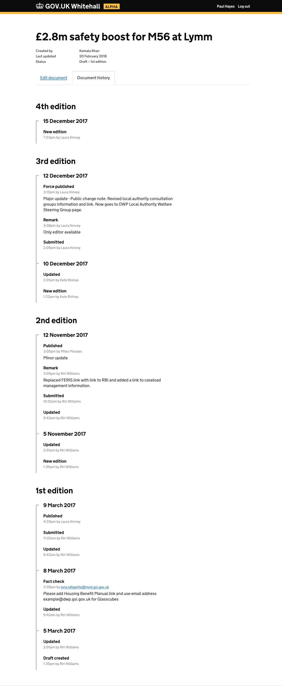

# GOV.UK Whitehall Prototype

https://whitehall-prototype.herokuapp.com

Built by the [GOV.UK Publishing Workflow team](https://gov-uk.atlassian.net/wiki/spaces/GOVUK/pages/266928151/Publishing+Workflow+Alpha) using the [GOV.UK Prototype Kit](https://govuk-prototype-kit.herokuapp.com/docs) and the [GOV.UK Design System private beta](https://govuk-design-system-production.cloudapps.digital/) – added in [PR#14](https://github.com/alphagov/whitehall-prototype/pull/14).

The prototype explores a new way of writing and editing content using concepts familiar to Whitehall users.

The prototype was tested in [3 rounds of user research, documented in the prototype releases](https://github.com/alphagov/whitehall-prototype/releases).

## Running the prototype locally

The prototype uses a private npm package for the design system. The GOV.UK Design System team can provide the npm login details. Heroku uses a token to retrieve this package, see [48da520](https://github.com/alphagov/whitehall-prototype/commit/48da520).

```
npm install
npm start
```

## Screenshots

### Dashboard



### Choose an intent



### Choosing format



### Choose a document type



### Form to add a title, summary and body



### Document page



### Add an attachment



### Add details about the content



### Document history


